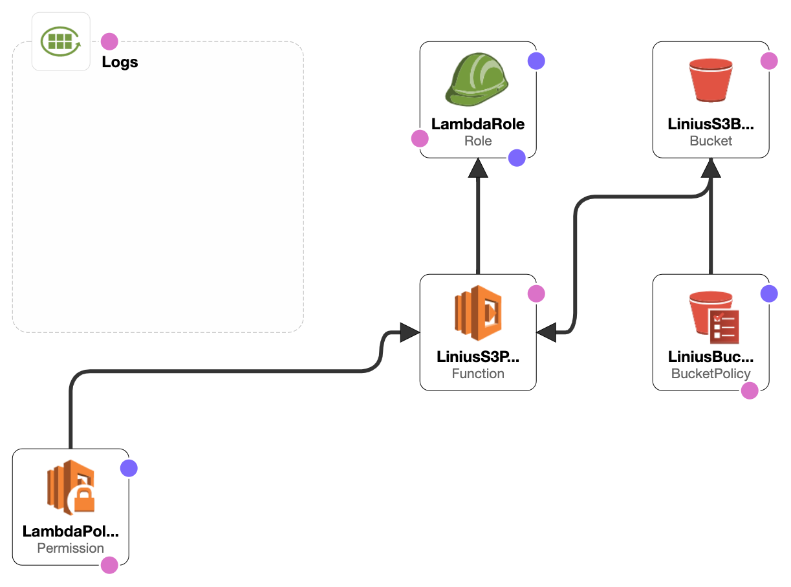
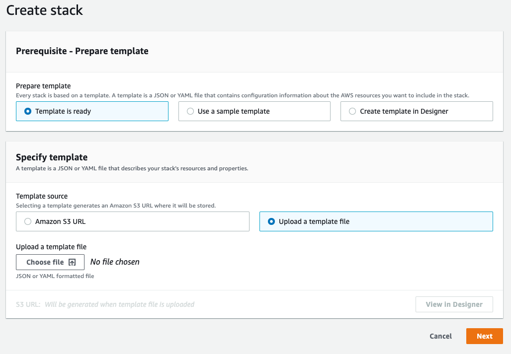
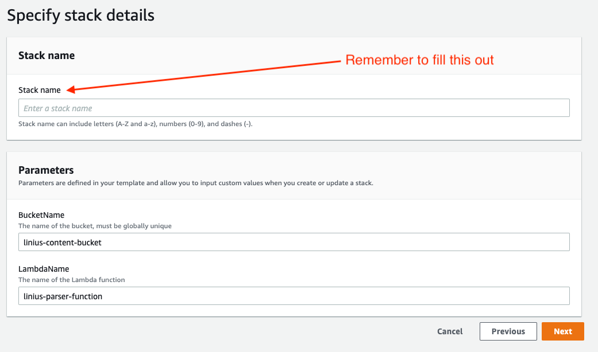
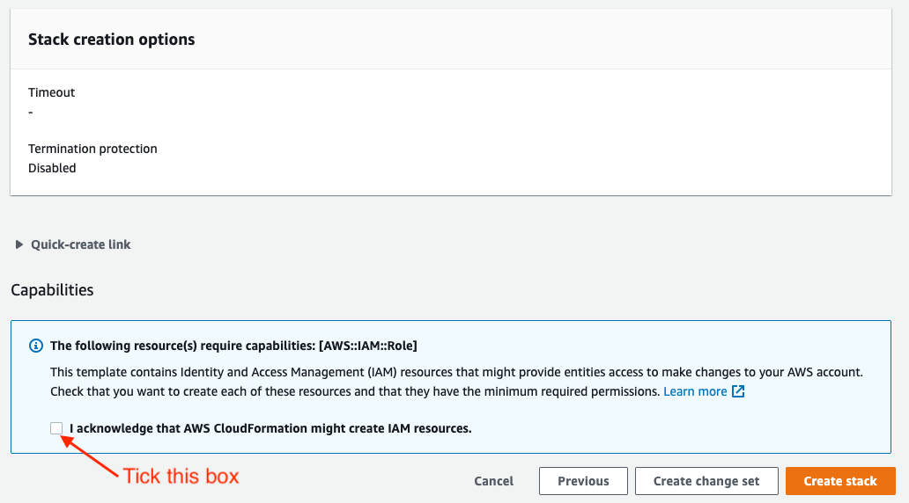

# Linius Secure Templates

This repo contains [AWS Cloudformation](https://docs.aws.amazon.com/AWSCloudFormation/latest/UserGuide/GettingStarted.Walkthrough.html) templates that will create an encrypted private bucket or cloudformation distribution in your organization that can be used with Linius Video Systems.

There are two variants in the `templates` directory:

* linius-s3-access.cf.yaml (S3 only)
* linius-cloudfront-access.cf.yaml (S3 and Cloudfront)

## How to create the Stack

1. Be sure to have your TenantID on hand which you should get from signing up to [LVS](https://lvs.linius.com/auth/signup).
2. To get started open up the [AWS Console](https://aws.amazon.com/console/) and go to the [Cloudformation](https://console.aws.amazon.com/cloudformation) service. You will need to do this with a user that has read/write permissions on the following resources:

	* Cloudformation
	* S3
	* IAM
	* Lambda
	* Cloudwatch
	* Cloudfront (Only used in the Cloudfront template)

3. Next [create a stack](https://docs.aws.amazon.com/AWSCloudFormation/latest/UserGuide/GettingStarted.Walkthrough.html#GettingStarted.Walkthrough.createstack) by clicking on Create stack > With new resources (standard)

Go to Choose file and find the file `linius-s3-access.cf.yaml` file in this repository (should be in the `templates` directory). Once that's done click next to move onto the next step.

4. Specify the stack details by providing a name for the Cloudformation stack. This doesn't impact the name of any of the created resources, only the name of the cloudformation stack itself. You then have two parameters you can define if you choose to:

	* 	**BucketName:** Defaults to `linius-content-bucket-${YOUR_AWS_ACCOUNT_ID}` if you leave the default value
	*  **LambdaName:** Defaults to `linius-parser-function` but can be changed. Note, this also impacts the name of the Cloudwatch Log Group where any logs generated by parsed files is located
	*  **TenantId:** Your tenant ID you get after registering with [LVS](https://lvs.linius.com/auth/signup)
	*  **PublicKeyId:** ID of the unique public RSA key given after signing up to LVS (Only used in the Cloudfront template)

	

5. On the next page for configuring stack options you shouldn't need to change anything here unless your organization has any specific standards for Cloudformation deployments. Ask your AWS Administrator/Team if this is the case.

6. Finally review what the Stack will create and be sure to enable IAM capabilities before clicking on "Create stack"
 

7. Once the stack finishes deploying you should have a private bucket created that can be used with Linius. The attached Lambda function makes sure to fix any filenames so that they work with our technology's standards.